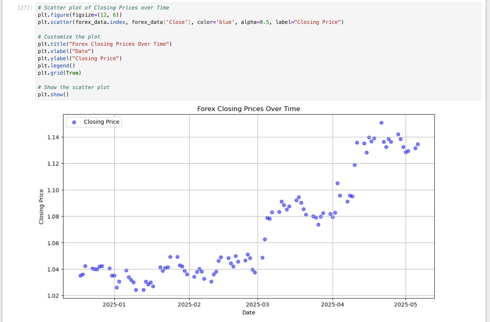
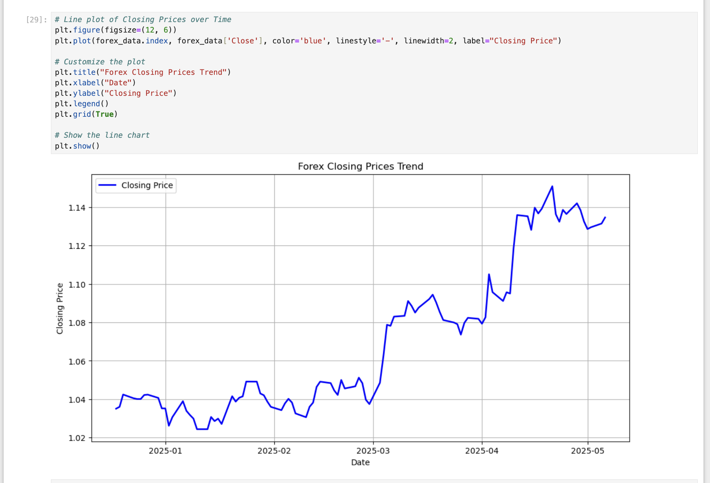
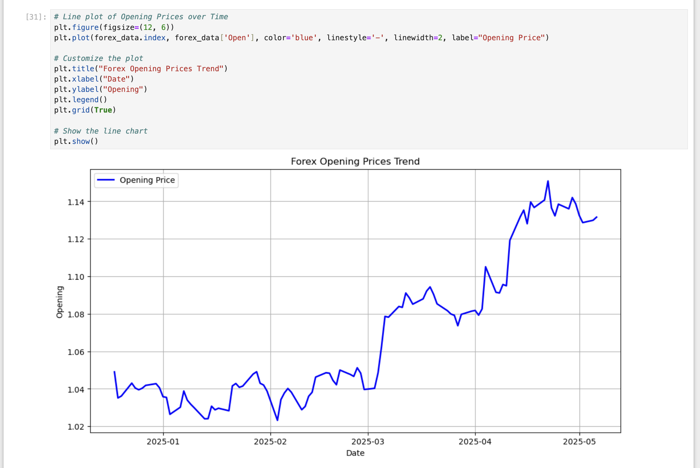
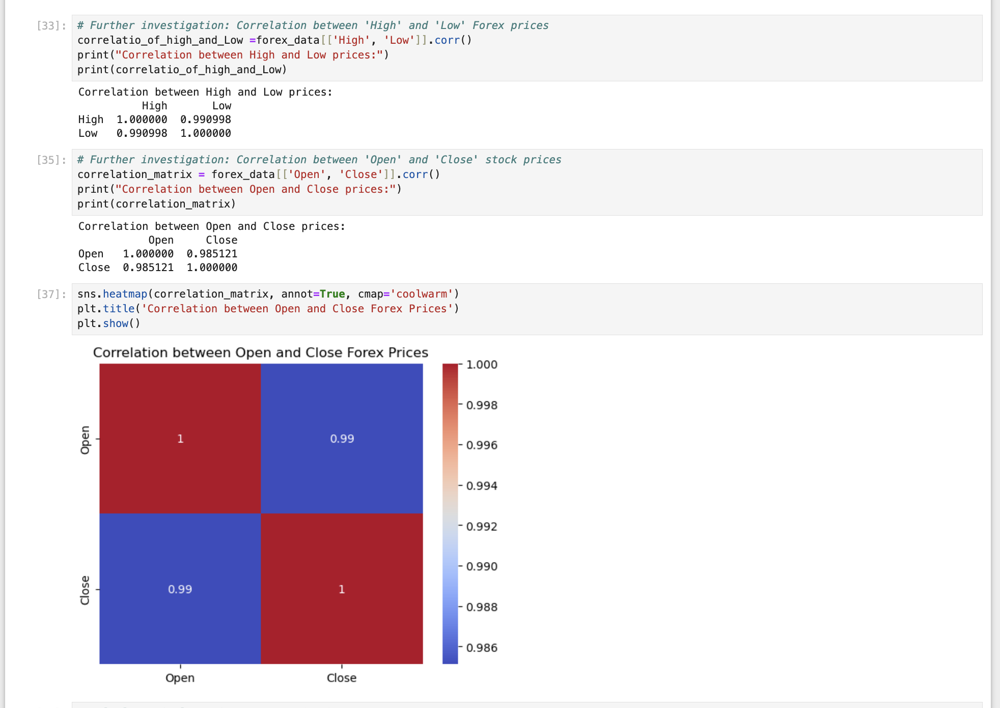
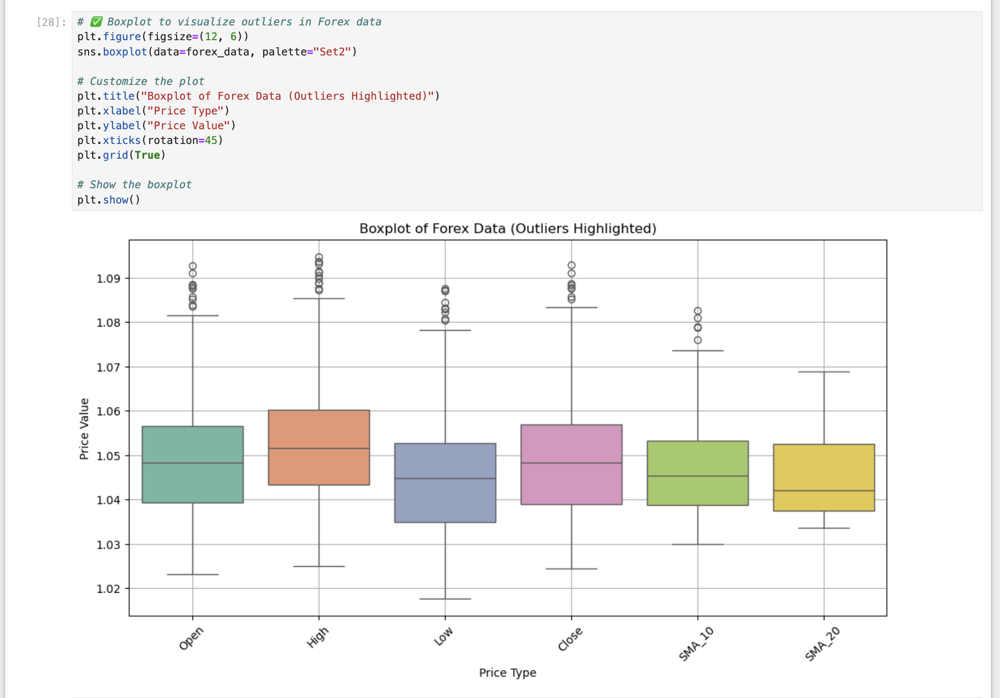
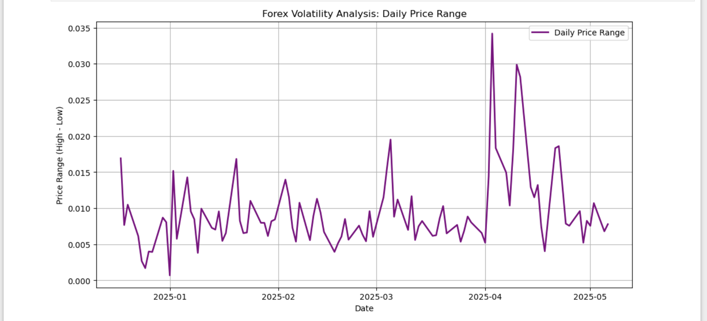
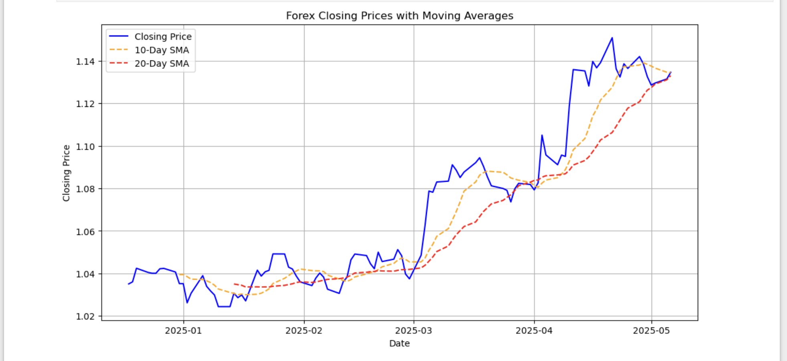
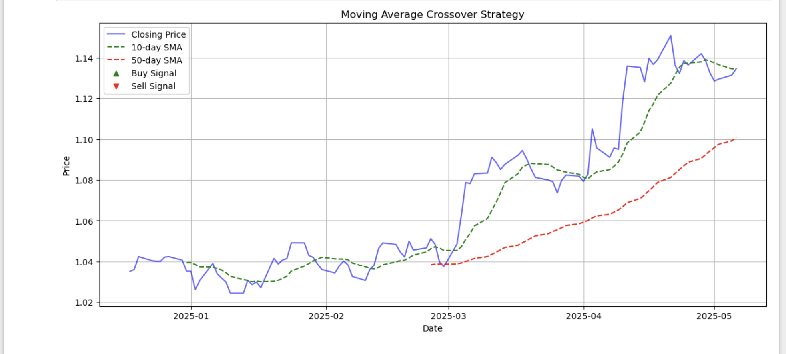
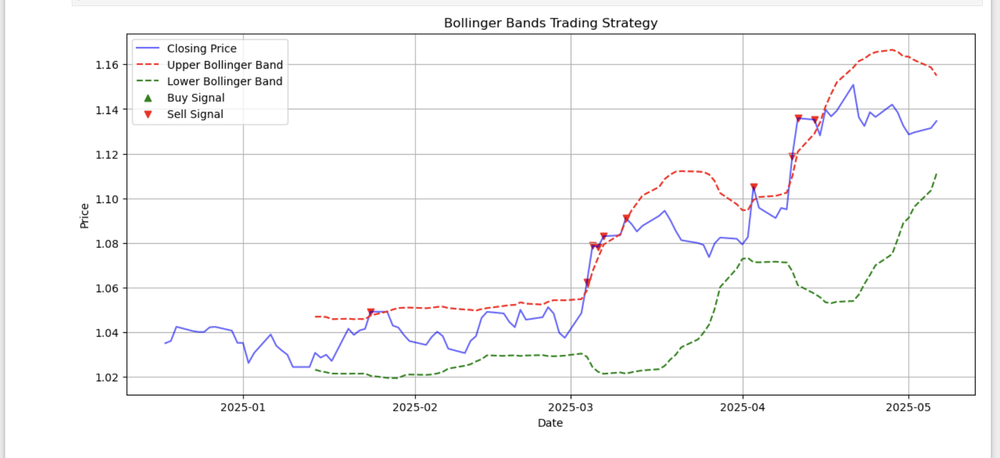
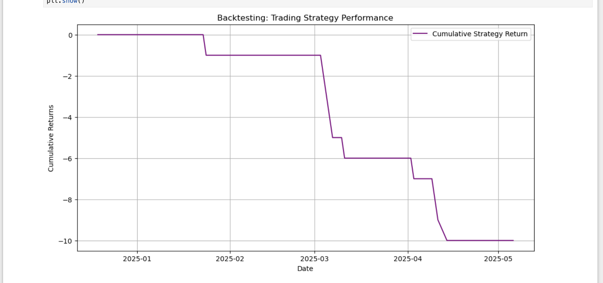

# 📊 Forex Data Analysis & Trading Strategy

This project presents a comprehensive analysis of EUR/USD Forex data using Python. It covers exploratory data analysis, volatility analysis, outlier detection, and the implementation of two technical trading strategies: Moving Average Crossover and Bollinger Bands. The project also includes performance backtesting of the strategies.

---

## 🔍 Project Objectives
- Visualize trends in Forex price data (Open, Close, High, Low)
- Detect outliers and understand their behavior
- Analyze volatility through price range variations
- Build and visualize trading strategies
- Backtest strategy performance using cumulative returns

---

## 🛠️ Tools & Libraries
- Python, Pandas, NumPy
- Matplotlib, Seaborn
- Scikit-learn, SHAP
- Jupyter Notebook

---

## 📈 Visualizations

### 1. Forex Closing Price (Scatter)


### 2. Forex Closing Price Trend (Line)


### 3. Forex Opening Price Trend


### 4. Correlation Between Open and Close Prices


---

## 📉 Outlier Detection

### 5. Boxplot of Forex Price Outliers


### 6. Outliers in Closing Price (Scatter)


---

## 📊 Volatility Analysis

### 7. Daily Price Range – Volatility


---

## 📈 Strategy Development

### 8. Moving Average Strategy


### 9. Moving Average Crossover Strategy


### 10. Bollinger Bands Trading Strategy


---

## 🔁 Strategy Evaluation

### 11. Backtesting Strategy Performance


---

## 📂 Project Structure
```
├── forex_data_analysis.ipynb
├── Forex_Data_Analysis_Report.pdf
├── README.md
├── images/
│   └── [All visualization images]
```

---

## 🔗 Links
- 📘 [Jupyter Notebook](forex_data_analysis.ipynb)
- 📄 [Final Report (PDF)](Forex_Data_Analysis_Report.pdf)
- 🌐 [Live Portfolio](https://felix-aid.github.io/)

